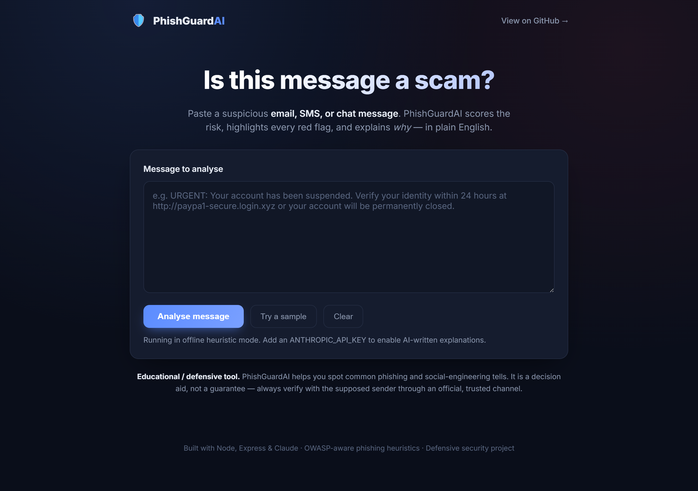

# PhishGuard

A web tool that analyses a suspicious email, SMS, or chat message and reports how likely it is to be a phishing or scam attempt. It returns a risk score, the specific warning signs it found (with evidence), and a clear explanation of why the message is risky and what to do about it.


## Overview

Most people can't tell a well-crafted phishing message from a real one, and generic "be careful online" advice doesn't help in the moment. PhishGuard looks at an actual message and points to the concrete tactics it uses, so the warning is specific and actionable.

The detection logic is a transparent, rule-based engine that runs entirely on the server with no external calls, so the tool always works. An optional language-model layer turns the technical findings into a short, friendly explanation; if it isn't configured, a built-in deterministic explanation is used instead.

## Screenshots

| Paste a message | Result |
| :---: | :---: |
|  |  |

## What it detects

The engine scores a message across well-known phishing and social-engineering signals, each weighted by severity:

- Manufactured urgency ("act now", "within 24 hours", "account will be suspended")
- Requests to verify, confirm, or update account credentials
- Requests for sensitive data (OTP, CVV, PIN, card number, seed phrase)
- Demands for payment via untraceable methods (gift cards, wire transfer, crypto)
- Too-good-to-be-true bait (lottery wins, refunds, prizes, inheritance)
- Threats of legal or financial consequences
- Suspicious links: raw IP hosts, URL shorteners, punycode/homograph domains, abused TLDs, brand look-alikes such as `paypa1.com`, and excessive sub-domains
- Generic greetings ("Dear Customer") instead of a real name
- Pressure to open an attachment or move to a private channel

Scores map to four verdicts: Safe, Suspicious, Likely Phishing, and Dangerous.

## Getting started

```bash
git clone https://github.com/ramsai676/ai-phishing-detector.git
cd ai-phishing-detector
npm install
npm start
# open http://localhost:3000
```

The tool works with no configuration. To enable the written explanations, copy `.env.example` to `.env` and add an `ANTHROPIC_API_KEY`.

Run the tests:

```bash
npm test
```

## API

### `POST /api/analyze`

Request:

```json
{ "message": "URGENT: verify your account at http://paypa1-secure.xyz" }
```

Response (abridged):

```json
{
  "score": 92,
  "verdict": { "level": "dangerous", "label": "Dangerous - Very Likely a Scam" },
  "signals": [
    {
      "id": "suspicious_url",
      "label": "Suspicious or deceptive link",
      "severity": "high",
      "evidence": "paypa1-secure.xyz looks like 'paypal'",
      "explanation": "Always read the real domain before clicking."
    }
  ],
  "summary": "Dangerous - Very Likely a Scam. Detected 3 risk signals.",
  "explanation": "This message is almost certainly a scam..."
}
```

### `GET /api/health`

Returns service status.

## How it works

```
message --> rule-based analyzer (offline)  --> score + signals + verdict
                      |
                      v
            explanation layer (optional)    --> plain-English summary
            (deterministic fallback if no API key)
```

The detection rules live in `src/analyzer.js` and are fully inspectable. The explanation layer lives in `src/llm.js`.

## Tech stack

- Node.js and Express (ES modules)
- Vanilla HTML, CSS, and JavaScript front end with an animated risk gauge
- Built-in `node:test` for unit tests
- Optional Anthropic API integration for written explanations, with a deterministic fallback

## Scope

This is a defensive tool. It analyses messages a user has already received to help them stay safe. It does not generate phishing content or attack any system. Treat the result as a decision aid, not a guarantee, and always verify with the supposed sender through an official channel.

## License

MIT. See [LICENSE](LICENSE).
